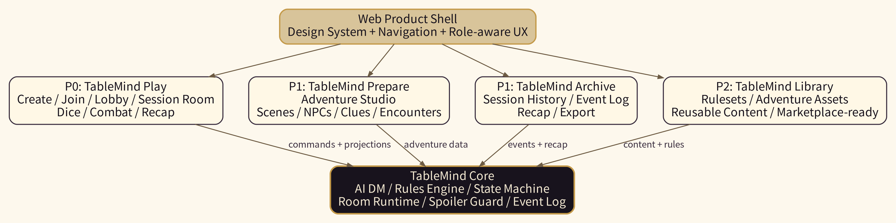
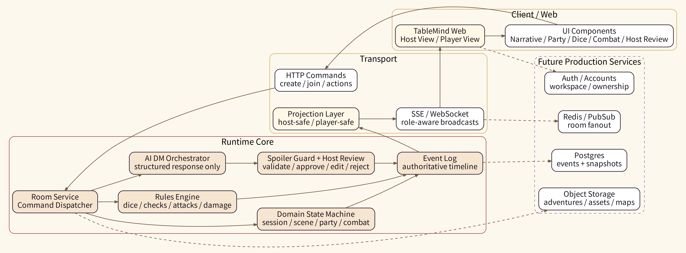
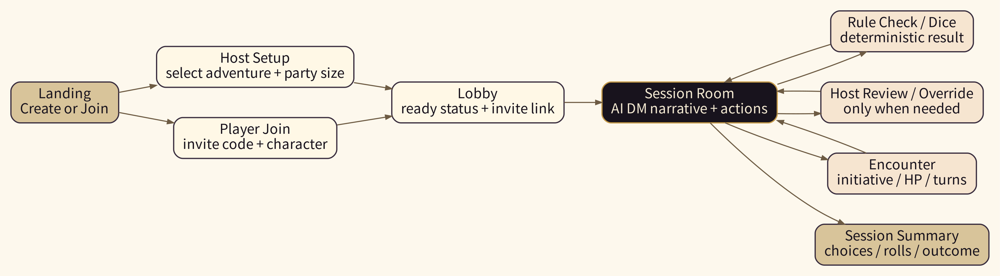
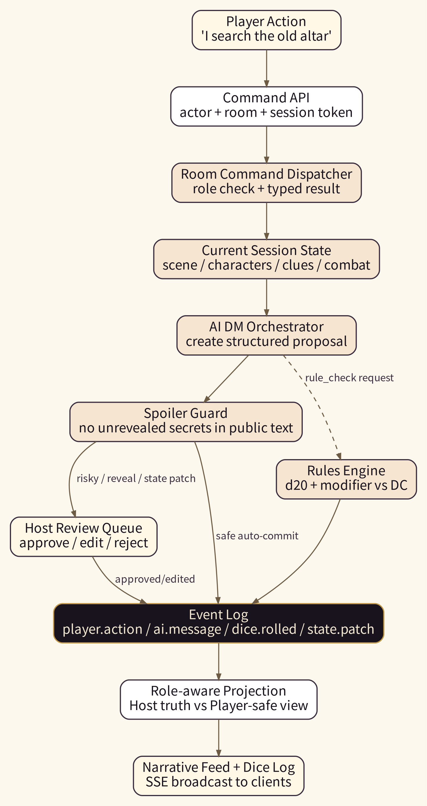
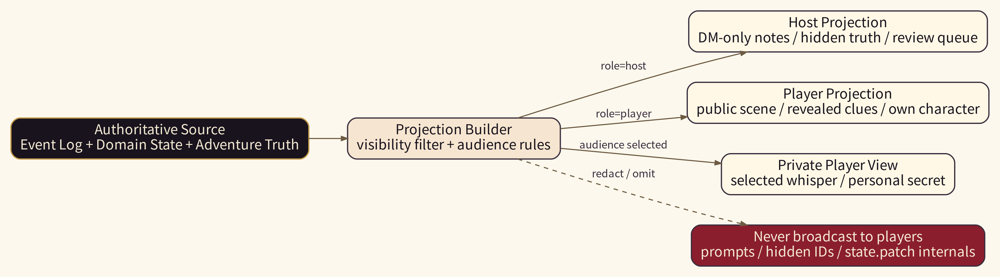
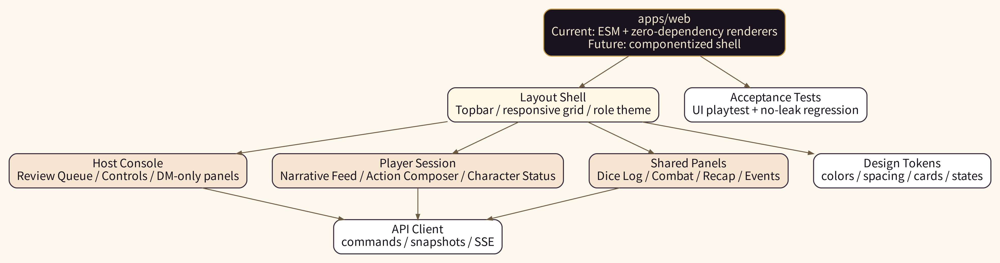
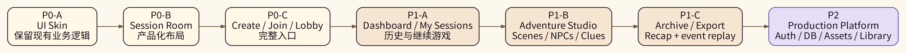

# 目录

| 序号 | 章节 |
|---:|---|
| - | 文档说明 |
| 1 | 执行摘要 |
| 2 | 当前项目基线 |
| 3 | 产品定位 |
| 4 | 总体产品架构 |
| 5 | 功能拆分：P0 / P1 / P2 |
| 6 | 用户流程图 |
| 7 | Runtime 数据流 |
| 8 | 权限与防剧透设计 |
| 9 | 前端 Web 信息架构 |
| 10 | 前端实现方案 |
| 11 | 后续拓展架构 |
| 12 | API 与事件契约建议 |
| 13 | UI 设计系统建议 |
| 14 | 测试与质量门槛 |
| 15 | 风险与应对 |
| 16 | Codex 实施计划 |
| 17 | 推荐文件结构 |
| 18 | 最终推荐 |
| A | UI zip 功能映射表 |
| B | 验收清单 |

# 文档说明

本文档用于指导 TableMind 后续 Web 端产品化建设。核心结论是：**TableMind 当前项目继续作为跑团玩法核心；之前生成的 UI zip 包不作为独立新产品，而作为 TableMind 完整 Web 产品外壳、设计系统和功能蓝图被逐步吸收。**

本文档包含：

- 产品定位和合并策略。
- TableMind Core 与 Web Product Shell 的边界。
- P0 / P1 / P2 功能拆分。
- 后续拓展架构图、流程图、权限边界图。
- 前端 Web 实现方案。
- Codex 执行计划与验收标准。
- 风险、测试、质量门槛和下一阶段路线。

# 1. 执行摘要

TableMind 当前最有价值的资产不是 UI，而是已经形成的 **AI-assisted tabletop session engine**：房间、Host/Player 视图、规则引擎、AI DM 编排、防剧透、Host Review、事件日志、战斗与 recap。UI zip 包的价值在于它提供了完整跑团平台的视觉方向和功能地图：Dashboard、角色、线索、NPC、地图、战斗、日志、设置等。

推荐策略不是把二者并列，而是形成下面的关系：

```text
TableMind Core = 玩法核心 / 状态权威 / 规则裁判 / AI DM 编排
UI zip = 视觉系统 / 页面结构 / 完整产品功能蓝图
最终目标 = TableMind Web App
```

第一阶段不要从“大而全跑团后台”开始。先把 TableMind 现有 playtest flow 包装成真正可演示、可内测、可复用的 **TableMind Play**：Create Game、Join Game、Lobby、Session Room、Dice & Rules Log、Combat、Host Console、Recap。

第二阶段再把 UI zip 的完整功能吸收成 **TableMind Prepare / Archive / Library**：冒险准备、NPC/线索/遭遇管理、战报档案、素材库和长期扩展。



# 2. 当前项目基线

根据当前仓库状态，TableMind 已经不是从零开始。现有项目已经有一个本地 browser playtest flow，能支持 Host 创建房间、复制邀请链接、玩家加入、创建 demo-ready characters、加载 demo adventure、开始冒险、运行安全的 AI DM turn、执行确定性检定、揭示线索、跑战斗并生成 recap。

但它仍然应被视为 **内部/本地 MVP demo**，不是生产就绪版本。当前限制包括：内存房间状态、Host 监督为主、未接生产级账号、持久化数据库、多进程房间 runtime、付费、市场、完整 VTT、完整角色创建器等。

## 2.1 当前已有能力

| 能力 | 当前状态 | 产品化意义 |
|---|---|---|
| Host 创建房间 | 已有 | TableMind Play 的入口基础 |
| 邀请链接 | 已有 | 多人同房间的关键闭环 |
| Player 加入 | 已有 | 支持玩家端体验 |
| Demo 角色 | 已有 | 可快速进入 one-shot |
| Demo 冒险 | 已有 | 可以作为稳定演示内容 |
| AI DM turn | 已有 mock/live-provider boundary | 核心差异化能力 |
| 确定性检定 | 已有 | 规则不由 LLM 胡判 |
| 防剧透 / Host Review | 已有 | TableMind 的护城河 |
| Combat UI | 已有基础能力 | one-shot 可玩性的关键节点 |
| Recap | 已有 | 形成一次完整游戏回路 |
| 中英文 UI labels | 已有基础 | 后续本地化可延展 |

## 2.2 当前不宜立即做的事情

- 不要直接覆盖现有 `apps/web`。
- 不要把 UI zip 当成新项目替代 TableMind。
- 不要一上来迁移成大型 React/Next 项目并改动核心接口。
- 不要优先做完整地图编辑器、完整 VTT、完整角色创建器。
- 不要让 AI DM 看起来可以直接决定 HP、物品、状态或规则结果。
- 不要让普通玩家看到 DM-only 内容、隐藏 clue、hidden encounter、Host review payload、内部 event type 或 prompt。

# 3. 产品定位

## 3.1 一句话定位

**TableMind 是面向 D&D 5e-compatible one-shot 的多人 AI DM Web 产品：LLM 负责叙事，规则引擎负责裁判，状态机负责事实，Host 面板负责兜底。**

## 3.2 核心用户

| 用户 | 目标 | 需要的 UI |
|---|---|---|
| 新手玩家 | 快速加入并玩完一局 | Join、角色状态、行动输入、AI DM 叙事、骰子结果、战斗提示 |
| Host / 人类 DM | 监督 AI，纠错接管 | Host Console、Review Queue、DM-only notes、Reveal、Patch State、Combat Controls |
| 模组/冒险作者（后续） | 让剧本可被 AI 主持 | Adventure Studio、Scenes、NPCs、Clues、Encounters、Secrets |
| 复盘用户 | 查看战报和关键结果 | Archive、Recap、Event Log、Dice History、Export Markdown |

## 3.3 与传统 VTT 的区别

TableMind 第一阶段不是做 Roll20 / Foundry 的替代品。传统 VTT 强在地图、棋子、光照、复杂资源管理；TableMind 第一阶段应该强在：

- AI DM 主持短冒险。
- 多人同房间状态一致。
- 规则由确定性代码执行。
- AI 不泄露 DM-only 信息。
- Host 可审核、修正、撤回、接管。
- 一局结束后生成可复盘的 recap。

# 4. 总体产品架构

TableMind 建议采用“一核三层”结构：

- **核心层：TableMind Core**，负责玩法权威。
- **P0 产品层：TableMind Play**，让用户真的玩完一局。
- **P1 产品层：TableMind Prepare + Archive**，让 Host 能准备、管理和复盘。
- **P2 平台层：TableMind Library + Production Platform**，支持长期内容、账号、资产、市场和生产化。



## 4.1 TableMind Core

TableMind Core 是不可被 UI 取代的核心。它负责：

- Room lifecycle。
- Player join / reconnect。
- Session phase。
- Adventure runtime projection。
- Domain state。
- Rules engine。
- Dice / checks / attacks / damage。
- Combat turn state。
- AI DM orchestration。
- Spoiler guard。
- Host review。
- Event log。
- Player-safe projection。
- Recap generation。

## 4.2 Web Product Shell

Web Product Shell 是 UI zip 应该发挥作用的地方。它负责：

- 品牌与视觉系统。
- 页面导航。
- Host / Player 双视图体验。
- Narrative Feed。
- Action Composer。
- Dice & Rules Log。
- Combat Panel。
- Host Console。
- Recap / Archive。
- 后续 Prepare / Library / Settings。

## 4.3 关键边界

| 事项 | 归属 | 原则 |
|---|---|---|
| HP 改变 | Rules Engine 或 Host override | AI DM 只能提出，不能直接落库 |
| 检定结果 | Rules Engine | d20、modifier、DC、success/failure 可追踪 |
| 当前场景 | Domain State | UI 展示 projection，不自建事实 |
| AI 叙事 | AI DM Orchestrator + Guard | 必须经过结构化验证和防剧透 |
| 隐藏信息 | Projection Layer | 玩家侧永不接收原始隐藏 payload |
| Host 接管 | Host Command | 写入 event log，保留审计 |
| UI 状态 | Web Shell | 只保存临时展开、tab、输入框等 |

# 5. 功能拆分：P0 / P1 / P2

## 5.1 P0：TableMind Play

P0 目标：**让用户在浏览器里完成一局 60-90 分钟的 AI DM one-shot。**

| 模块 | 页面/组件 | 说明 |
|---|---|---|
| Landing | Entry Page | 说明产品、Create / Join 入口 |
| Host Setup | Create Game | 选择 demo 冒险、party size、语言、邀请链接 |
| Join Game | Join Page | 输入 invite code / 链接，昵称和角色 |
| Lobby | Waiting Room | 玩家列表、ready、Host start |
| Session Room | 核心页面 | AI DM narrative、玩家行动、角色状态、骰子、线索 |
| Dice & Rules Log | 规则日志 | 明确显示结果来自 rules engine |
| Combat Panel | 遭遇面板 | initiative、当前回合、HP、conditions、attack |
| Host Console | Host 专属 | Review、Reveal、Patch、Pause AI、Change Scene |
| Recap | Summary | 剧情结果、关键检定、战斗、奖励、导出 |

## 5.2 P1：TableMind Prepare / Archive

P1 目标：**让 Host 能准备、管理、复盘一局，不只是跑 demo。**

| UI zip 原功能 | TableMind 推荐名称 | 说明 |
|---|---|---|
| 我的团 | My Sessions | 房间历史、继续游戏、recent recaps |
| 团首页 | Game Overview | 当前 adventure/session 摘要 |
| 世界设定 | Adventure Codex | 结构化剧本条目，Host/Player 可见性分离 |
| NPC / 怪物库 | Entities | NPC、怪物、隐藏实体、出场状态 |
| 任务与线索 | Objectives & Clues | 已揭示/未揭示 clue board |
| 剧情日志 | Session Archive | event log、dice history、recap |
| 资料库 | Adventure Assets | handouts、maps、images、markdown |
| 设置 | Room / Host Settings | 语言、规则包、tone、安全、权限 |

## 5.3 P2：Production Platform

P2 目标：**从内测工具升级为可长期运营的平台。**

| 模块 | 说明 |
|---|---|
| Accounts/Auth | 用户、Host、Player、Workspace |
| Durable Storage | Postgres event log + snapshots |
| Realtime Scale | Redis pub/sub 或 room process fanout |
| Adventure Library | 官方自制 demo、用户私有冒险、未来市场 |
| Asset Storage | PDF、地图、handout、图片、音频 |
| Import Pipeline | Markdown / PDF 结构化导入 |
| Payments / Marketplace | 暂缓到商业化后 |
| Full VTT features | 地图网格、fog、lighting，长期后置 |

# 6. 用户流程图

P0 的核心流程是 Host 创建、玩家加入、Lobby ready、开始冒险、玩家行动、AI DM 回复、规则检定、战斗、recap。



## 6.1 Host 流程

1. 打开 TableMind。
2. Create Game。
3. 选择 `The Lantern Beneath the Hill / 山丘下的灯火` 或其他 demo adventure。
4. 确认 ruleset：5e SRD-compatible。
5. 设置 party size：2-4。
6. 创建 room。
7. 复制 invite link。
8. 等待玩家加入和 ready。
9. Start Adventure。
10. 监督 AI DM。
11. 审核 risky AI output。
12. 运行/修正 combat。
13. End Session。
14. 查看和导出 recap。

## 6.2 Player 流程

1. 打开 invite link。
2. 输入昵称。
3. 创建或选择 demo-ready character。
4. 进入 Lobby。
5. Mark Ready。
6. 阅读 AI DM 开场。
7. 输入行动。
8. 接受规则检定和骰子结果。
9. 战斗时按回合行动。
10. 查看已揭示线索和角色状态。
11. 游戏结束后查看 recap。

# 7. Runtime 数据流

TableMind 的关键不是“AI 回了什么”，而是 **AI 回答是否可以安全进入公共状态**。因此每次玩家行动后的数据流应该是：命令 -> 状态读取 -> AI 结构化提案 -> spoiler guard -> Host review / auto commit -> rules engine -> event log -> projection -> SSE broadcast。



## 7.1 玩家行动处理

```text
Player submits action
→ HTTP command with actor/session token
→ Room dispatcher checks role and phase
→ Current session/adventure state is loaded
→ AI DM receives bounded context
→ AI DM returns structured proposal
→ Spoiler guard validates public text and reveal/state requests
→ Rules engine resolves checks if requested
→ Event log commits accepted changes
→ Projection layer builds Host/player-safe snapshots
→ SSE broadcasts only allowed data
```

## 7.2 AI DM 与 Rules Engine 职责

| 职责 | AI DM | Rules Engine |
|---|---|---|
| 描述场景 | 是 | 否 |
| 扮演 NPC | 是 | 否 |
| 建议需要检定 | 是 | 否 |
| 决定 DC | 可提出/按 adventure 指定 | 最终执行依据结构化规则 |
| 掷骰 | 否 | 是 |
| 判定成功/失败 | 否 | 是 |
| 修改 HP | 否 | 是/Host override |
| 添加 condition | 可提出 | Rules/Host 决定并记录 |
| 揭示 clue | 可提出 | Guard + Host/规则确认 |
| 写 event log | 否 | Runtime |

# 8. 权限与防剧透设计

权限边界是 TableMind 的核心竞争力。UI 必须体现：Host 可以看 truth，Player 只能看 projection。



## 8.1 可见性模型

建议统一使用以下 visibility / audience：

```ts
type Visibility =
  | "public"
  | "host_only"
  | "player_private"
  | "selected_players";
```

所有 Adventure 数据、Scene 文本、Clue、NPC、Encounter、Event Payload、Message 都应具备可见性语义。

## 8.2 Host 可见

- DM-only scene notes。
- Hidden truth / secrets。
- Unrevealed clues。
- Hidden encounter and combatant setup。
- Host review queue。
- AI pause/resume。
- Reveal clue。
- Change scene。
- Patch HP / condition。
- Combat controls。
- Audit information。

## 8.3 Player 不可见

- DM-only notes。
- Hidden truth。
- Unrevealed clue title/text/alias。
- Hidden encounter setup。
- Hidden monster stats before reveal/combat。
- Host review payload。
- `state.patch` / `host.override` 原始内部事件名。
- AI prompt / system prompt / private payload。
- Secret DC（如果产品设定为不公开 DC）。

## 8.4 UI 层必须做到

- 不通过 CSS 隐藏秘密内容；玩家侧 response 中不应出现秘密文本。
- Host-only 内容在 DOM 上必须只存在于 Host view。
- Player SSE 不接收 Host-only event payload。
- Event feed 对玩家使用友好安全文案，不暴露内部 event type。
- 所有 “Reveal” 操作明确显示将公开给谁。
- Host Override 必须被记录并可在 audit 中查看。

# 9. 前端 Web 信息架构

## 9.1 P0 路由建议

```text
/                         Landing
/host                     Host Setup
/player                   Join Game
/room/:roomId/lobby       Lobby
/room/:roomId/session     Session Room
/room/:roomId/summary     Session Summary
```

如果继续沿用当前静态页面，也可以短期保留：

```text
/host.html
/player.html?roomId=room_0001
```

但 UI 结构应向上述产品路由过渡。

## 9.2 P1 路由建议

```text
/sessions                 My Sessions
/sessions/:roomId         Game Overview
/sessions/:roomId/archive Session Archive
/adventures               Adventure Library
/adventures/:id/studio    Adventure Studio
/adventures/:id/scenes    Scenes
/adventures/:id/entities  NPCs / Monsters
/adventures/:id/clues     Clues
/adventures/:id/assets    Assets
/settings                 Settings
```

## 9.3 Session Room 页面布局

```text
┌────────────────────────────────────────────────────────────┐
│ Topbar: TableMind / Room / Locale / Connection / Role       │
├──────────────┬──────────────────────────────┬──────────────┤
│ Scene Panel  │ Narrative Feed               │ Party Panel  │
│ Current goal │ AI DM / NPC / Player / System │ HP / AC      │
│ Clues        │ Rule requests / Dice results  │ Conditions   │
├──────────────┴──────────────────────────────┴──────────────┤
│ Player Action Composer / Host Controls / Dice & Rules Log   │
└────────────────────────────────────────────────────────────┘
```

Host 视图在同一页面上额外包含：

```text
Host Review Queue
DM-only Notes
Reveal / Change Scene
AI Pause / Resume
Patch HP / Condition
Combat Host Controls
Event / Audit Log
```

# 10. 前端实现方案

## 10.1 总体建议

现有 `apps/web` 是 zero-dependency browser UI，并且已有 acceptance flow。推荐 **先不推翻现有技术栈**，而是采用渐进式方案：

1. **先改 UI 外观和布局，不改业务逻辑。**
2. **再拆 render modules，提高可维护性。**
3. **再补 Landing / Lobby / Session Room 产品页。**
4. **最后视复杂度决定是否 React/Vite 化。**

这比“立刻把整个 apps/web 改成 React”更稳，因为现有 playtest 和 acceptance tests 很可能依赖当前静态结构与命令路径。



## 10.2 Milestone 1：UI Skin，不改业务逻辑

目标：把当前 text-first playtest UI 变成 TableMind 品牌化界面。

建议新增/整理：

```text
apps/web/src/styles/
  tokens.css
  globals.css
  layout.css
  panels.css
  messages.css
  combat.css
```

如果当前构建不适合多 CSS 文件，则先通过一个 `styles.css` 汇总。

设计 tokens：

```css
:root {
  --tm-bg: #0E0B10;
  --tm-surface: #18131D;
  --tm-surface-2: #211A27;
  --tm-border: #3A2E3F;
  --tm-primary: #C49A4A;
  --tm-danger: #8B1E2D;
  --tm-parchment: #D8C49A;
  --tm-text: #F3E9D2;
  --tm-muted: #A99B86;
  --tm-arcane: #6F63B7;
}
```

验收标准：

- Host 创建房间流程不变。
- Player 加入流程不变。
- 所有现有 tests 仍通过。
- Host-only 信息仍只在 Host 页面出现。
- UI 有清晰暗色主题、卡片面板、按钮状态、消息分型。

## 10.3 Milestone 2：Session Room 重布局

目标：把当前 Host/player panel 集合重排为真正的跑团房间。

建议拆分 render 函数：

```text
apps/web/src/render/
  render-layout.mjs
  render-topbar.mjs
  render-host-console.mjs
  render-player-session.mjs
  render-narrative-feed.mjs
  render-scene-panel.mjs
  render-party-panel.mjs
  render-action-composer.mjs
  render-dice-rules-log.mjs
  render-combat-panel.mjs
  render-host-review-queue.mjs
  render-event-log.mjs
  render-recap.mjs
```

验收标准：

- Narrative Feed 区分 AI narration、NPC speech、Player action、System event、Rule check、Dice result、Combat update、Host override。
- Dice & Rules Log 明确显示 d20、modifier、DC、结果、success/failure。
- Combat panel 显示 round、active combatant、turn order、HP、AC、conditions。
- Host review queue 放在 Host 专属区域。
- Player 视图没有 hidden truth、review payload 或 DM-only notes。

## 10.4 Milestone 3：Landing / Create / Join / Lobby 产品化

目标：让用户不再感觉是在操作测试页，而是在使用一个完整产品。

页面：

- Landing：一句话说明、Create Game、Join Game。
- Host Setup：adventure 选择、ruleset、party size、language、safety/tone mock。
- Join Game：invite code、nickname、character。
- Lobby：player seats、ready、invite、start adventure。

验收标准：

- Host 可以从 Landing 到 Session。
- Player 可以从 invite link 到 Lobby。
- Ready 状态明确。
- Start Adventure 按钮只在 Host 可用。
- 没有破坏原有 `host.html` / `player.html` smoke path。

## 10.5 Milestone 4：Dashboard / My Sessions

目标：吸收 UI zip 中 Dashboard / 我的团 的价值，但只做轻量。

功能：

- Recent Sessions。
- Continue Session。
- Demo Adventure。
- Past Recaps。
- Local mock history。

暂不做账号体系和生产持久化。

## 10.6 Milestone 5：Adventure Studio

目标：吸收 UI zip 的 Wiki、NPC、线索、地图、资料库，转化为 TableMind 的冒险准备工具。

模块：

- Scenes。
- Read-aloud text。
- DM-only notes。
- NPCs。
- Clues。
- Encounters。
- Secrets。
- Handouts。
- Assets。

验收标准：

- 每个条目都有 visibility。
- 可导出为当前 runtime 能读取的 adventure fixture。
- Host 能预览 Player-safe projection。
- 不做公开市场和复杂 PDF 导入。

# 11. 后续拓展架构



## 11.1 从本地 MVP 到生产版本

| 阶段 | Runtime | Storage | Realtime | Auth | 内容 |
|---|---|---|---|---|---|
| 当前 | In-memory | fixtures | SSE local | 无 | demo adventure |
| P0 产品化 | In-memory / dev store | local fixtures | SSE | 可选本地昵称 | demo + mock |
| P1 内测 | Single process + snapshot | SQLite/Postgres dev | SSE | 简单 auth | private adventures |
| P2 生产 | Room runtime + event store | Postgres + object storage | Redis/WebSocket | accounts/workspaces | library/assets |

## 11.2 推荐服务边界

```text
apps/web              Web product shell
apps/server           HTTP/SSE adapter + room runtime
packages/domain       domain types/reducers/projections
packages/rules        rules engine and compendium helpers
packages/adventure    adventure schema/import/projection
packages/ai           AI DM orchestration and provider adapters
packages/shared       shared schemas, errors, utilities
```

如果当前仓库已存在类似结构，则延续现有结构，不要为“看起来现代”而重命名所有包。

## 11.3 生产化数据库建议

优先采用 event-sourced + snapshot 的混合模式：

- `events`：权威事件流。
- `room_snapshots`：加速恢复。
- `sessions`：房间和阶段。
- `players`：房间内身份。
- `characters`：角色状态。
- `adventures`：冒险元数据。
- `adventure_versions`：冒险内容版本。
- `assets`：文件元数据。
- `recaps`：战报。

关键规则：

- Event log 是事实历史。
- Snapshot 是缓存，不是唯一真相。
- Player projection 不能从原始隐藏数据直接拼。
- 所有 Host override 要进入 event log。

# 12. API 与事件契约建议

## 12.1 Command API

建议所有会改变状态的操作走 command：

```ts
type CommandEnvelope = {
  commandId: string;
  roomId: string;
  actorId: string;
  actorRole: "host" | "player";
  sessionToken: string;
  commandType: string;
  payload: unknown;
  clientTimestamp?: string;
};
```

建议返回：

```ts
type CommandResult<T = unknown> = {
  ok: boolean;
  commandType: string;
  data?: T;
  snapshot?: RoomProjection;
  error?: {
    code: string;
    message: string;
    details?: unknown;
  };
};
```

## 12.2 事件类型建议

P0 必要事件：

```text
room.created
player.joined
player.ready.updated
character.created
adventure.loaded
session.started
player.action.submitted
ai.turn.requested
host.review.created
host.review.updated
ai.message.committed
rule.check.requested
dice.rolled
rule.check.resolved
clue.revealed
combat.started
combat.turn.advanced
combat.attack.resolved
hp.changed
condition.added
condition.removed
host.override.applied
session.completed
recap.generated
```

## 12.3 Projection API

不要让客户端自己过滤秘密。服务端应提供：

```text
GET /rooms/:roomId/snapshot?sessionToken=...
GET /rooms/:roomId/adventure-snapshot?sessionToken=...&locale=zh-CN
GET /rooms/:roomId/recap?sessionToken=...&locale=zh-CN
GET /rooms/:roomId/events/stream?sessionToken=...
```

服务端根据 sessionToken 判断 Host 或 Player，然后返回不同 projection。

# 13. UI 设计系统建议

## 13.1 视觉方向

TableMind 的视觉应该从 UI zip 中吸收“暗黑奇幻 + 魔法卷宗 + 档案馆”的气质，但不能牺牲可读性。

推荐关键词：

```text
dark fantasy
readable narrative
clear system log
host authority
player-safe projection
rules transparency
```

## 13.2 消息类型样式

| 消息类型 | 样式建议 |
|---|---|
| AI narration | 羊皮纸卡片，较高可读性 |
| NPC speech | 左侧竖线 + NPC 名称 |
| Player action | 玩家头像/颜色，简洁气泡 |
| System event | 低对比度系统日志 |
| Rule check | 规则卡片，显示 skill/DC/modifier |
| Dice result | 大数字 + success/failure |
| Combat update | 深红/金色强调，显示 HP/turn |
| Host override | Host-only 警示样式 |
| Hidden/DM-only | 紫色/红色边框，明确标识 |

## 13.3 响应式布局

桌面端：三栏或两栏 + 底部 action composer。

平板端：Scene / Party 变成可折叠侧栏。

手机端：底部 tab：

```text
Story | Character | Dice | Combat | More
```

Host 手机上只保留轻量控制，不建议承载复杂 Adventure Studio。

# 14. 测试与质量门槛

## 14.1 必须保留的测试维度

| 类型 | 内容 |
|---|---|
| Unit | rules engine、dice、combat、projection、spoiler guard |
| Integration | room commands、HTTP adapter、SSE、review queue |
| Acceptance | Host 创建、Player 加入、AI turn、check、clue、combat、recap |
| No-leak | 玩家 snapshot / SSE / UI / recap 不包含 hidden truth |
| UI smoke | 主要页面可渲染，无 JS error |
| Localization | `zh-CN` / `en` labels 和 adventure authored text fallback |

## 14.2 每个 UI 里程碑的 Definition of Done

- 原有 `npm run check` 通过。
- 原有 `npm test` 通过。
- 原有 `npm run acceptance` 通过。
- 原有 `npm run build` 通过。
- Host flow 手动可跑通。
- Player flow 手动可跑通。
- Player DOM 中不出现 DM-only 文本样例。
- Host review / clue reveal / combat / recap 至少各跑一遍。
- README 或 docs 更新。

# 15. 风险与应对

| 风险 | 表现 | 应对 |
|---|---|---|
| 范围膨胀 | 过早做完整 VTT、地图、市场 | P0 只做可玩一局 |
| React 迁移破坏 demo | acceptance tests 大量失败 | 先 skin + modular render，再迁移 |
| AI 泄露秘密 | 玩家看到未揭示 clue | projection + spoiler guard + no-leak tests |
| AI 胡改状态 | AI 叙事直接改变 HP | AI 只能提出，规则/Host 执行 |
| 状态不同步 | Host/Player 看到不同事实 | event log + authoritative server snapshot |
| UI 暴露内部事件 | 玩家看到 `host.override` / `state.patch` | player-friendly event projection |
| 规则复杂度失控 | 完整 5e 自动化太大 | 只支持 one-shot 必要规则 |
| 中英混乱 | UI labels 和 authored text 混杂 | locale-aware labels + fallback 策略 |
| 性能问题 | 长 session feed 卡顿 | feed windowing / snapshot compaction |

# 16. Codex 实施计划

## 16.1 总提示词

```text
你现在接手 TableMind 当前仓库。

目标不是创建新 TRPG 项目，也不是把外部 UI zip 直接覆盖进来。
不要把项目改名为“烛影之桌”或其他新产品名。

产品策略：
- TableMind 当前项目是跑团玩法核心，必须保留。
- TableMind Core 负责 AI DM、规则引擎、房间系统、多玩家同步、Host Review、防剧透、骰子、战斗、event log。
- 之前生成的 TRPG UI zip 只作为视觉系统、页面结构和完整产品功能蓝图参考。
- 第一阶段围绕现有 playtest flow 产品化 Host / Player UI，不直接覆盖 apps/web，不破坏当前 demo flow，不扩大到完整 VTT 或泛用跑团后台。

请先阅读 README.md、docs/PRD.md、docs/CURRENT_STATUS.md、apps/web/src/、apps/server/src/room-actions.mjs、apps/server/src/http-server.mjs、apps/server/src/room-service.mjs、tests/acceptance/mvp-ui-playtest.acceptance.test.mjs。

完成第一阶段 TableMind Web Play UI 改造：
1. 保留 Host 创建房间、邀请链接、Player 加入、角色、冒险、AI turn、Host review、check、clue、combat、recap 的现有流程。
2. 吸收 UI zip 的 dark fantasy / archive / parchment 风格 tokens。
3. 重构当前 Host/Player UI 布局为产品化 Session Room 和 Host Console。
4. 明确保留 Host-only / Player-safe 权限边界。
5. 不做完整地图编辑器、完整 VTT、完整角色创建器、真实 DB、真实 auth、付费。
6. 更新 docs/frontend-product-shell.md。
7. 运行 npm run check、npm test、npm run acceptance、npm run build；失败则修复或记录原因。
```

## 16.2 Milestone 1 具体任务

```text
任务：只做 UI skin 和布局整理，不改变业务逻辑。

请在 apps/web 中整理样式 tokens 和基础布局：
- dark theme
- cards/panels
- topbar
- command buttons
- Host-only badges
- message cards
- dice/rules cards
- combat cards

不要改变 command API，不要删除现有 renderer，不要破坏 tests。

完成后更新 docs/frontend-product-shell.md，说明 UI zip 的哪些视觉元素被吸收。
```

## 16.3 Milestone 2 具体任务

```text
任务：把 Host/Player 页面拆成更清晰的 render modules。

建议新增：
- render-layout.mjs
- render-narrative-feed.mjs
- render-scene-panel.mjs
- render-party-panel.mjs
- render-dice-rules-log.mjs
- render-combat-panel.mjs
- render-host-review-queue.mjs
- render-recap.mjs

保持原有 host-app.mjs / player-app.mjs 工作方式。不要引入 React。
```

## 16.4 Milestone 3 具体任务

```text
任务：产品化入口。

新增或改造：
- Landing
- Host Setup
- Join Game
- Lobby

确保旧的 /host.html 和 /player.html?roomId=... 仍能作为 smoke path 工作。
```

# 17. 推荐文件结构

## 17.1 近期结构（保留 vanilla ESM）

```text
apps/web/
  host.html
  player.html
  src/
    host-app.mjs
    player-app.mjs
    api-client.mjs
    event-stream-client.mjs
    i18n.mjs
    render/
      render-layout.mjs
      render-topbar.mjs
      render-host-console.mjs
      render-player-session.mjs
      render-narrative-feed.mjs
      render-scene-panel.mjs
      render-party-panel.mjs
      render-dice-rules-log.mjs
      render-combat-panel.mjs
      render-host-review-queue.mjs
      render-event-log.mjs
      render-recap.mjs
    styles/
      tokens.css
      globals.css
      layout.css
      panels.css
      messages.css
      combat.css
      responsive.css
```

## 17.2 中期结构（如果 React 化）

```text
apps/web/
  src/
    main.tsx
    App.tsx
    routes/
      AppRouter.tsx
    pages/
      LandingPage.tsx
      HostSetupPage.tsx
      JoinGamePage.tsx
      LobbyPage.tsx
      SessionRoomPage.tsx
      SessionSummaryPage.tsx
    components/
      layout/
      session/
      host/
      player/
      dice/
      combat/
      character/
      ui/
    services/
      tablemindApi.ts
      eventStream.ts
    types/
      room.ts
      session.ts
      adventure.ts
      event.ts
      combat.ts
    styles/
      tokens.css
      globals.css
```

React 化应在以下条件满足后再做：

- P0 UI 已稳定。
- acceptance tests 已覆盖主要 flow。
- Command / snapshot / SSE contract 稳定。
- 有明确收益，例如组件复杂度、状态管理和 routing 已经让 vanilla 难以维护。

# 18. 最终推荐

TableMind 的成败不取决于是否拥有最多页面，而取决于是否能让 2-4 名玩家真的完成一局像 D&D 的 one-shot，并且 AI 不胡判、不剧透、Host 能兜底。

因此建议顺序是：

1. **守住 TableMind Core。** 不动规则、状态、投影和防剧透边界。
2. **先产品化 Session Room。** 把 playtest UI 变成可演示的跑团房间。
3. **再吸收 UI zip 的完整功能。** Dashboard、Adventure Studio、Archive、Library 分阶段做。
4. **最后生产化。** Auth、DB、资产、内容库、导入、市场都放在玩法闭环验证后。

一句话：

> **TableMind 做可玩的 AI DM 房间核心，UI zip 做完整 Web 产品外壳蓝图；先让用户玩完一局，再把平台做大。**

# 附录 A：UI zip 功能映射表

| UI zip 页面 | TableMind 中的位置 | 优先级 | 说明 |
|---|---|---|---|
| Dashboard | My Sessions | P1 | 不挡 P0 |
| 我的团 | My Games / Sessions | P1 | 历史房间 |
| 团首页 | Game Overview | P1 | 当前冒险摘要 |
| 本次跑团工作台 | Session Room | P0 | 最高优先级 |
| 骰子面板 | Dice & Rules Log | P0 | 必须来自 rules engine |
| 战斗面板 | Encounter Panel | P0 | 轻量即可 |
| 角色卡详情 | Character Sheet Panel | P0 | 只做游玩所需 |
| 任务与线索 | Objectives & Clues | P0/P1 | P0 展示已揭示，P1 管理全部 |
| 剧情日志 | Event Log / Recap | P0/P1 | 当前 event log 可产品化 |
| Wiki | Adventure Codex | P1 | 剧本准备 |
| NPC / 怪物库 | Entities | P1 | 冒险结构化内容 |
| 地图 | Map / Handouts | P2 | 不做完整 VTT |
| 资料库 | Adventure Assets | P1/P2 | 先 handout，后 asset storage |
| 日程 | Scheduling | P2 | 等账号/长期房间后再做 |
| 设置 | Room / Host Settings | P0/P1 | P0 只保留必要 controls |

# 附录 B：验收清单

P0 Web Play 完成时，应满足：

- Host 能创建 room。
- 玩家能通过 invite link 加入。
- 至少 2 个玩家能创建/选择角色。
- Host 能开始冒险。
- AI DM 能发送开场叙事。
- 玩家能提交行动。
- 至少一次检定由 rules engine 处理。
- 骰子结果进入 Dice & Rules Log。
- 至少一条线索可被 reveal。
- 至少一次 combat 可开始、推进、结束。
- Host 能 pause/resume AI。
- Host review queue 可以 approve/reject/edit。
- Session 可以 complete。
- Recap 可以查看。
- Player 视图不泄露 Host-only 内容。
- 原有自动化命令通过。
